# FasiTech Forms Platform

Solução moderna de formulários web com Streamlit e backend FastAPI, rodando em EC2, com integrações para Google Drive, Google Sheets e envio de e-mails.

## 🎯 Funcionalidades

- ✅ **Portal centralizado** com múltiplos formulários
- ✅ **Formulário ACC** para atividades complementares curriculares
- ✅ **Formulário TCC** para submissão de trabalhos finais
- ✅ **Formulário Requerimento TCC** para registro de defesa
- ✅ **Formulário Estágio** para envio de documentos de estágio
- ✅ **Formulário Plano de Ensino** aceita qualquer tipo de arquivo (PDF, DOC, DOCX, ODT, imagens, etc)
- ✅ **Formulário Projetos** para submissão de projetos de ensino, pesquisa e extensão
- ✅ **Upload seguro** de arquivos ao Google Drive
- ✅ **Registro automático** em Google Sheets
- ✅ **Notificações por e-mail** para coordenação
- ✅ **UX moderna** com design responsivo e identidade visual institucional

## 📁 Estrutura principal

```text
├── .streamlit/         # Configurações do Streamlit (tema, secrets)
├── config/             # Configurações por ambiente (dev/prod)
├── src/
│   ├── app/
│   │   ├── main.py     # Página principal com links para formulários
│   │   └── pages/      # Formulários individuais
│   ├── services/       # Lógica de negócio (Drive, Sheets, Email)
│   ├── models/         # Schemas Pydantic
│   └── utils/          # Utilitários (validadores, criptografia)
├── api/                # Backend FastAPI (opcional)
├── credentials/        # Credenciais Google divididas por ambiente
├── docker/             # Arquivos de containerização
├── scripts/            # Scripts de deploy e automação
└── tests/              # Suite de testes
```

## 📝 Formulários disponíveis

- **Formulário ACC**: Upload de certificados consolidados (PDF único, máx 10MB)
- **Formulário TCC**: Submissão de documentos obrigatórios do TCC 1/2
- **Formulário Requerimento TCC**: Registro de banca e dados para defesa
- **Formulário Estágio**: Envio de plano e relatório de estágio
- **Formulário Plano de Ensino**: Aceita qualquer tipo de arquivo (PDF, DOC, DOCX, ODT, imagens, etc)
- **Formulário Projetos**: Submissão de projetos de ensino, pesquisa e extensão

## 🚀 Primeiros passos

### 1. Instale as dependências

```bash
python -m venv .venv
source .venv/bin/activate  # No Windows: .venv\Scripts\activate
pip install -r requirements-dev.txt
```

### 2. Configure os secrets do Streamlit

O arquivo `.streamlit/secrets.toml` já foi criado com valores padrão. Edite-o conforme necessário:

```bash
# Edite o arquivo com suas credenciais reais
nano .streamlit/secrets.toml
```

Estrutura do arquivo:

```toml
[acc]
drive_folder_id = "seu-folder-id-do-google-drive"
sheet_id = "seu-spreadsheet-id"
notification_recipients = ["coordenacao@fasitech.edu.br"]
```

> **Nota:** O arquivo `secrets.toml` está no `.gitignore` e não será commitado ao repositório.

### 3. Adicione credenciais do Google

Coloque o arquivo JSON da conta de serviço do Google em:
- `credentials/dev/service-account-dev.json` (desenvolvimento)
- `credentials/prod/service-account-prod.json` (produção)

### 4. Execute a aplicação

**Opção A: Usando o script de inicialização (Recomendado)**

```bash
# Torna o script executável (apenas na primeira vez)
chmod +x scripts/start.sh

# Execute
./scripts/start.sh
```

**Opção B: Manualmente**

```bash
# Configure o PYTHONPATH e execute
export PYTHONPATH="${PWD}:${PYTHONPATH}"
streamlit run src/app/main.py
```

A aplicação estará disponível em `http://localhost:8501`

### 5. (Opcional) Execute o backend FastAPI

```bash
uvicorn api.main:app --reload --port 8000
```

## 🧪 Testes

```bash
pytest
```

## 🐳 Docker

### Desenvolvimento
```bash
cd docker
docker-compose up
```

### Produção
```bash
docker build -f docker/Dockerfile.prod -t fasitech-forms .
docker run -p 8501:8501 -p 8000:8000 fasitech-forms
```

## 🧩 Arquitetura do Sistema

```mermaid
flowchart LR
    %% Camada do Usuário
    User["👤 Usuário<br/>Docente/Aluno"]
    Form["📝 Streamlit Web<br/>Formulário"]

    %% Camada de Entrada de Dados
    FormData[("📋 Dados Submetidos<br/>• Informações<br/>• Anexos")]

    %% Camada Oracle VM
    VM["🖥️ Oracle VM<br/>Servidor Linux"]
    App["⚙️ FasiTech App<br/>Streamlit + FastAPI"]

    %% Camada de Processamento
    Router{"🔀 Identificar<br/>Tipo de Formulário"}

    %% Tipos de Formulário
    FormACC["📋 ACC<br/>Atividades Complementares"]
    FormPROJ["🔬 Projetos<br/>Pesquisa/Extensão"]
    FormTCC["📝 TCC<br/>Trabalho de Conclusão"]
    FormESTAGIO["💼 Estágio<br/>Obrigatório/Não-Obrigatório"]
    FormPLANO["📚 Plano de Ensino<br/>Disciplinas"]

    %% Destinatários
    subgraph Recipients ["📬 Destinatários"]
        direction TB
        Coord["👔 Gestores FASI"]
        Parecer["👨‍🏫 Pareceristas<br/>Docentes avaliadores"]
        Student["🎓 Alunos<br/>Cópia de confirmação"]
    end

    %% Armazenamento
    subgraph Storage ["💾 Armazenamento Organizado"]
        direction TB
        DriveACC["📁 ACC/<br/>Turma/Matrícula"]
        DrivePROJ["📁 Projetos/<br/>Edital/Ano/Docente/Tipo"]
        DriveTCC["📁 TCC/<br/>Tipo/Turma/Aluno"]
        DriveEST["📁 Estágio/<br/>Tipo/Turma/Aluno"]
        DrivePLANO["📁 Plano de Ensino/<br/>Semestre"]
    end

    %% Fluxo de Dados Principal
    User -->|"Preenche"| Form
    Form -->|"Submete dados"| FormData
    FormData -->|"POST"| VM
    VM --> App
    App -->|"Analisa"| Router

    %% Roteamento por tipo
    Router -->|"ACC"| FormACC
    Router -->|"Projetos"| FormPROJ
    Router -->|"TCC"| FormTCC
    Router -->|"Estágio"| FormESTAGIO
    Router -->|"Plano de Ensino"| FormPLANO

    %% Processamento Paralelo
    subgraph Processing ["⚙️ Processamento Paralelo"]
        direction TB
        Email["📧 Envio de Email<br/>• Notificação aos responsáveis<br/>• Anexa documentos gerados"]

        subgraph DocGen ["📝 Processamento de Dados"]
            direction TB
            PDF["📄 Geração de PDFs<br/>• Parecer técnico<br/>• Declaração (se Extensão)"]
            IA["🧠 LLM<br/>• Extração de dados<br/>• Analisa as Informações"]
        end

        Drive["☁️ Google Drive<br/>• Organiza anexos<br/>• Cria estrutura de pastas"]
    end

    %% Processamento de cada tipo
    FormACC --> Processing
    FormPROJ --> Processing
    FormTCC --> Processing
    FormESTAGIO --> Processing
    FormPLANO --> Processing

    %% Ações paralelas
    Email -.->|"Notifica"| Recipients
    Drive -.->|"Salva"| Storage

    %% Estilos
    classDef userLayer fill:#E1F5FE,stroke:#01579B,stroke-width:3px,color:#000
    classDef dataLayer fill:#F3E5F5,stroke:#4A148C,stroke-width:2px,color:#000
    classDef vmLayer fill:#FFF3E0,stroke:#E65100,stroke-width:3px,color:#000
    classDef formType fill:#E8F5E9,stroke:#1B5E20,stroke-width:2px,color:#000
    classDef processing fill:#E0F2F1,stroke:#004D40,stroke-width:2px,color:#000
    classDef recipients fill:#FCE4EC,stroke:#880E4F,stroke-width:2px,color:#000
    classDef storage fill:#FFF9C4,stroke:#F57F17,stroke-width:2px,color:#000

    class User,Form userLayer
    class FormData dataLayer
    class VM,App vmLayer
    class Router vmLayer
    class FormACC,FormPROJ,FormTCC,FormESTAGIO,FormPLANO formType
    class Email,IA,PDF,Drive processing
    class Coord,Parecer,Student recipients
    class DriveACC,DrivePROJ,DriveTCC,DriveEST,DrivePLANO storage
```



## 🎨 Personalização

O tema visual está configurado em `.streamlit/config.toml`:
- Cor primária: `#663399` (roxo institucional)
- Gradientes e sombras seguindo design system
- Logo da instituição: `src/resources/fasiOficial.png`

## 📧 Suporte

Em caso de dúvidas, entre em contato com a equipe de TI ou secretaria acadêmica.
