# Arquitetura do Sistema FasiTech

## Visão Integrada da Arquitetura

```mermaid
graph TB
    subgraph "CLIENT"
        FE["🎨 Frontend React<br/>(TypeScript + Tailwind)"]
    end

    subgraph "API_GATEWAY"
        FASTAPI["⚙️ FastAPI Gateway<br/>(Port 8000)"]
    end

    subgraph "PRESENTATION_LAYER"
        subgraph "API_V1"
            ACC_API["📋 ACC Form API"]
            TCC_API["📚 TCC Form API"]
            EST_API["💼 Estágio Form API"]
            PROJ_API["🎯 Projetos API"]
            PLAN_API["📖 Plano Ensino API"]
            DISC_API["📘 Disciplinas API"]
            RAG_API["🤖 RAG - Diretor Virtual"]
        end
        
        subgraph "API_ADMIN"
            LANC_API["📊 Lançamentos API"]
            ALERT_API["🔔 Alertas API"]
        end

        subgraph "DATA_APIs"
            SOCIAL_DATA["👥 Social Data API"]
            PROJ_DATA["📊 Projetos Data API"]
            TCC_DATA["📋 TCC Data API"]
        end
    end

    subgraph "DOMAIN_LAYER"
        subgraph "ENTITIES"
            ENTITY1["Aluno"]
            ENTITY2["Disciplina"]
            ENTITY3["Componente"]
            ENTITY4["Lançamento"]
        end
        
        subgraph "USE_CASES"
            UC1["Matricular"]
            UC2["Consolidar"]
            UC3["Processar ACC"]
            UC4["Gerar Alertas"]
        end

        subgraph "REPOSITORIES"
            REPO1["IAluno"]
            REPO2["IDisciplina"]
            REPO3["ILancamento"]
            REPO4["IComponente"]
        end
    end

    subgraph "INFRASTRUCTURE_LAYER"
        subgraph "SIGAA_DOMAIN"
            SIGAA_SVC["🎓 SIGAA Automation<br/>(Playwright)"]
            MATRICULAR["Matricular ACC/TCC"]
            CONSOLIDAR["Consolidar ACC/TCC"]
            DADOS_REGISTRO["Registro de Dados"]
        end

        subgraph "DATABASE_DOMAIN"
            DB["🗄️ PostgreSQL<br/>(Docker)"]
            REPO_IMPL["Repository Implementation"]
            MODELS["SQLModel Entities"]
        end

        subgraph "RAG_DOMAIN"
            DOC_PROC["📄 Document Processing"]
            LANGCHAIN["🔗 LangChain"]
            EMBEDDINGS["🧠 Vector Embeddings"]
            VECTOR_DB["📊 Vector Store"]
        end

        subgraph "EMAIL_DOMAIN"
            SMTP["📧 SMTP Service"]
            NOTIF["Notificações"]
        end

        subgraph "SCHEDULER_DOMAIN"
            APScheduler["⏰ APScheduler"]
            ALERT_JOB["Alert Job"]
            CLEAN_JOB["Cleanup Job"]
        end

        subgraph "FILE_PROCESSING"
            FP["📁 File Processing"]
            DOCX["DOCX Handler"]
            PDF["PDF Handler"]
        end

        subgraph "GOOGLE_DOMAIN"
            GDrive["🔗 Google Drive API"]
            GSHEETS["Google Sheets"]
        end
    end

    subgraph "EXTERNAL_SERVICES"
        SIGAA_EXT["🎓 SIGAA<br/>(UFPA System)"]
        CLAUDE_API["🤖 Claude API<br/>(Anthropic)"]
        GOOGLE_API["🔗 Google API"]
        SMTP_EXTERNAL["📧 SMTP<br/>(Email Provider)"]
    end

    subgraph "DATA_STORAGE"
        PG["PostgreSQL"]
        VECTOR_STORAGE["Vector Storage"]
    end

    %% Frontend → API Gateway
    FE -->|HTTP/REST| FASTAPI

    %% API Gateway → Presentation Layer
    FASTAPI --> ACC_API
    FASTAPI --> TCC_API
    FASTAPI --> EST_API
    FASTAPI --> PROJ_API
    FASTAPI --> PLAN_API
    FASTAPI --> DISC_API
    FASTAPI --> RAG_API
    FASTAPI --> LANC_API
    FASTAPI --> ALERT_API
    FASTAPI --> SOCIAL_DATA
    FASTAPI --> PROJ_DATA
    FASTAPI --> TCC_DATA

    %% Presentation → Domain
    ACC_API --> UC1
    TCC_API --> UC2
    LANC_API --> UC1
    LANC_API --> UC2
    ALERT_API --> UC4

    %% Domain → Infrastructure
    UC1 --> SIGAA_SVC
    UC2 --> SIGAA_SVC
    UC1 --> REPO_IMPL
    UC2 --> REPO_IMPL
    UC3 --> DOC_PROC
    UC4 --> APScheduler

    %% Infrastructure → External Services
    SIGAA_SVC --> SIGAA_EXT
    RAG_API --> LANGCHAIN
    LANGCHAIN --> CLAUDE_API
    DOC_PROC --> PDF
    DOC_PROC --> DOCX
    NOTIF --> SMTP_EXTERNAL
    GDrive --> GOOGLE_API

    %% Infrastructure → Data Storage
    REPO_IMPL --> DB
    LANGCHAIN --> VECTOR_DB
    APScheduler --> DB

    %% Styling
    classDef client fill:#e1f5ff,stroke:#01579b,stroke-width:2px
    classDef gateway fill:#fff3e0,stroke:#e65100,stroke-width:2px
    classDef presentation fill:#f3e5f5,stroke:#4a148c,stroke-width:2px
    classDef domain fill:#e8f5e9,stroke:#1b5e20,stroke-width:2px
    classDef infra fill:#fce4ec,stroke:#880e4f,stroke-width:2px
    classDef external fill:#fff9c4,stroke:#f57f17,stroke-width:2px
    classDef storage fill:#eceff1,stroke:#263238,stroke-width:2px

    class FE client
    class FASTAPI gateway
    class ACC_API,TCC_API,EST_API,PROJ_API,PLAN_API,DISC_API,RAG_API,LANC_API,ALERT_API,SOCIAL_DATA,PROJ_DATA,TCC_DATA presentation
    class UC1,UC2,UC3,UC4,ENTITY1,ENTITY2,ENTITY3,ENTITY4,REPO1,REPO2,REPO3,REPO4 domain
    class SIGAA_SVC,MATRICULAR,CONSOLIDAR,DOC_PROC,LANGCHAIN,EMBEDDINGS,NOTIF,APScheduler,FP,GDrive infra
    class SIGAA_EXT,CLAUDE_API,GOOGLE_API,SMTP_EXTERNAL external
    class DB,VECTOR_DB storage
```



---

## Domínios de Serviço

### 1. **PRESENTATION LAYER** 🎨
Camada de apresentação com APIs RESTful organizadas por domínio de negócio.

#### 1.1 Domínio de Formulários (`/api/v1/forms/`)
| Endpoint | Recurso | Descrição |
|----------|---------|-----------|
| `POST /acc` | ACC Form | Atividades Curriculares Complementares |
| `POST /tcc` | TCC Form | Trabalho de Conclusão de Curso |
| `POST /estagio` | Estágio Form | Atividades de Estágio |
| `POST /plano-ensino` | Plano Ensino Form | Planejamento de Disciplinas |
| `POST /projetos` | Projetos Form | Gestão de Projetos |
| `POST /requerimento-tcc` | Requerimento TCC | Requisições para TCC |
| `POST /avaliacao-gestao` | Avaliação Gestão | Avaliação Acadêmica |

#### 1.2 Domínio de Dados (`/api/v1/data/`)
| Endpoint | Recurso | Descrição |
|----------|---------|-----------|
| `GET /social-data` | Dados Sociais | Informações socioeconômicas |
| `GET /projetos-data` | Dados Projetos | Listagem de projetos |
| `GET /tcc-data` | Dados TCC | Listagem de TCCs |

#### 1.3 Domínio de Ofertas (`/api/v1/ofertas/`)
| Endpoint | Recurso | Descrição |
|----------|---------|-----------|
| `GET /disciplinas` | Disciplinas | Oferta de disciplinas |

#### 1.4 Domínio de RAG (`/api/v1/rag/`)
| Endpoint | Recurso | Descrição |
|----------|---------|-----------|
| `POST /diretor-virtual` | Diretor Virtual | Chat IA - LLM Claude |

#### 1.5 Domínio Admin (`/api/admin/`)
| Endpoint | Método | Descrição |
|----------|--------|-----------|
| `/lancamentos` | `GET` | Listar lançamentos com filtros |
| `/lancamentos/matricular` | `POST` | Automatizar matrícula SIGAA |
| `/lancamentos/consolidar` | `POST` | Automatizar consolidação SIGAA |
| `/lancamentos/atualizar-status` | `PATCH` | Atualizar status manual |
| `/lancamentos/componentes-validos` | `GET` | Listar componentes válidos |
| `/alertas` | `GET` | Listar alertas acadêmicos |

---

### 2. **DOMAIN LAYER** 🎯
Camada de lógica de negócio com entidades, use cases e repositórios.

#### 2.1 Entities
```
├─ Aluno
│  ├─ matricula: str
│  ├─ nome: str
│  ├─ email: str
│  └─ polo: str
│
├─ Disciplina
│  ├─ codigo: str
│  ├─ nome: str
│  └─ carga_horaria: int
│
├─ Componente (ACC/TCC/Estágio)
│  ├─ tipo: str
│  ├─ nome: str
│  └─ descricao: str
│
└─ Lançamento
   ├─ matricula: str
   ├─ periodo: str
   ├─ componente: str
   ├─ matriculado: bool
   └─ consolidado: bool
```

#### 2.2 Use Cases
- `Matricular`: Executar matrícula no SIGAA
- `Consolidar`: Consolidar conceito no SIGAA
- `Processar ACC`: Processar atividades complementares
- `Gerar Alertas`: Criar alertas acadêmicos
- `Processar Documentos`: Indexar documentos para RAG

#### 2.3 Repositories (Abstração)
- `IAluno`: Interface para dados de alunos
- `IDisciplina`: Interface para disciplinas
- `ILancamento`: Interface para lançamentos
- `IComponente`: Interface para componentes

---

### 3. **INFRASTRUCTURE LAYER** 🔧

#### 3.1 Domínio SIGAA (`/infrastructure/sigaa/`)
Automação Playwright para interação com SIGAA.

**Serviço Principal**: `LancamentoService`
```python
class LancamentoService:
    - COMPONENTES_VALIDOS: {"ACC", "ACC I-IV", "TCC", "TCC I-II"}
    - COMPONENTES_EXPANDIDOS: {mapping}
    - _expand_componentes(): Expande ACC/TCC
    - matricular(): Matrícula com expansão
    - consolidar(): Consolidação com expansão
```

**Módulos de Automação**:
| Arquivo | Função | Descrição |
|---------|--------|-----------|
| `matricular.py` | `executar_fluxo_direto()` | ACC I-IV matrícula |
| `matricular_tcc.py` | `executar_fluxo_direto()` | TCC I-II matrícula |
| `consolidar.py` | `executar_consolidacao()` | ACC I-IV consolidação |
| `consolidar_tcc.py` | `executar_consolidacao()` | TCC I-II consolidação |

**Fluxo Integrado**:
```
LancamentoService.matricular()
  ├─ Expande componente (ACC → [ACC I, II, III, IV])
  ├─ Para cada componente:
  │  ├─ Importa módulo dinâmico (matricular.py ou matricular_tcc.py)
  │  ├─ Cria SimpleNamespace args
  │  ├─ Executa automação Playwright
  │  └─ Coleta sucesso/erro
  └─ Retorna ResultadoOperacao com detalhes

API Endpoint → LancamentoService → Database atualizar_status()
```

#### 3.2 Domínio Database (`/infrastructure/database/`)
Camada de persistência com SQLModel.

**Modelos**:
- `LancamentoConceito`: Matrícula e consolidação
- `Aluno`: Dados do aluno
- `Disciplina`: Oferta de disciplinas
- `LancamentoConceitoFormulario`: Histórico de formulários

**Operações Principais**:
```python
atualizar_status_lancamento(
    matricula, periodo, polo, componente,
    matriculado=None, consolidado=None
)
get_lancamento_conceitos(tipo_formulario, polo, periodo, turma, componente_estagio)
```

#### 3.3 Domínio RAG (`/infrastructure/rag/`)
Processamento de documentos e embedding com LangChain.

**Pipeline**:
```
Documento (DOCX/PDF)
  ├─ Processamento de arquivo
  ├─ Chunking de texto
  ├─ Geração de embeddings (Claude)
  ├─ Armazenamento em vector store
  └─ Recuperação para RAG
```

**Serviço**: `DirectorVirtualService`
- Processa documentos de normas/resoluções
- Gera respostas contextuzalizadas com Claude API

#### 3.4 Domínio Email (`/infrastructure/email/`)
Notificações via SMTP.

#### 3.5 Domínio Scheduler (`/infrastructure/scheduler/`)
Tarefas agendadas com APScheduler.

- **Alert Job**: Gera alertas baseado em calendário acadêmico
- **Cleanup Job**: Limpeza de dados antigos

#### 3.6 Domínio File Processing (`/infrastructure/file_processing/`)
Processamento de arquivos.

- DOCX Handler
- PDF Handler
- Excel Handler

#### 3.7 Domínio Google (`/infrastructure/google/`)
Integração com Google Drive e Google Sheets.

---

### 4. **EXTERNAL SERVICES** 🌐

| Serviço | Domínio | Uso |
|---------|---------|-----|
| **SIGAA** | Educação | Matrícula, consolidação, dados acadêmicos |
| **Claude API** | IA | RAG, respostas inteligentes |
| **Google Drive** | Storage | Compartilhamento de documentos |
| **Google Sheets** | Data | Planilhas de dados |
| **SMTP** | Email | Notificações |

---

## Fluxos de Dados Principais

### Fluxo 1: Matrícula e Consolidação
```
Frontend React
    ↓ (POST /api/admin/lancamentos/matricular)
FastAPI Endpoint
    ↓
LancamentoService.matricular()
    ├─ Expande componente
    ├─ Importa módulo SIGAA correto
    └─ Executa Playwright
        ↓ (Interage com SIGAA)
    Retorna ResultadoOperacao
        ↓
API Endpoint
    ├─ Extrai componentes sucesso
    └─ Atualiza Database status
        ↓
Frontend invalida cache
    ↓
Tabela atualiza
```

### Fluxo 2: RAG - Diretor Virtual
```
Frontend Chat
    ↓ (POST /api/v1/rag/diretor-virtual)
FastAPI Endpoint
    ↓
DirectorVirtualService.consultar()
    ├─ Recupera documentos relevantes (vector store)
    ├─ Cria contexto
    └─ Chama Claude API
        ↓
    Retorna resposta
        ↓
Frontend exibe resposta
```

### Fluxo 3: Processamento de Formulário
```
Frontend Form
    ↓ (POST /api/v1/forms/acc)
FastAPI Endpoint
    ↓
Domain UseCase (ProcessarACC)
    ├─ Valida dados
    ├─ Executa lógica negócio
    └─ Persiste em Database
        ↓
Repository Implementation
    ↓
PostgreSQL
    ↓
Retorna resultado
    ↓
Frontend exibe confirmação
```

---

## Stack Tecnológico por Camada

| Camada | Tecnologia | Versão |
|--------|-----------|--------|
| **Frontend** | React + TypeScript | 18.x |
| **Frontend Styling** | Tailwind CSS | 3.x |
| **Frontend State** | React Query | 5.x |
| **API Gateway** | FastAPI | 0.100+ |
| **Domain Layer** | Python Puro | 3.11+ |
| **Infrastructure** | SQLModel, LangChain | Latest |
| **Automation** | Playwright | 1.40+ |
| **Database** | PostgreSQL | 15+ |
| **Cache/Vector** | Chroma/FAISS | Latest |
| **LLM** | Claude API | Latest |
| **Container** | Docker Compose | 2.x |
| **Reverse Proxy** | Nginx | 1.25+ |

---

## Dependências e Fluxos de Controle

```
┌─────────────────────────────────────────────────┐
│         FRONTEND (React/TypeScript)             │
│    ↓ HTTP/REST ↓ React Query Mutations ↓        │
├─────────────────────────────────────────────────┤
│        FASTAPI GATEWAY (Port 8000)              │
│  ↓ Routing ↓ Dependency Injection ↓ Auth ↓      │
├─────────────────────────────────────────────────┤
│     PRESENTATION LAYER (APIs by Domain)         │
│  ├─ /api/v1/forms/*                             │
│  ├─ /api/v1/data/*                              │
│  ├─ /api/v1/ofertas/*                           │
│  ├─ /api/v1/rag/*                               │
│  └─ /api/admin/*                                │
│    ↓ Domain Service Calls ↓                     │
├─────────────────────────────────────────────────┤
│     DOMAIN LAYER (Business Logic)               │
│  ├─ Use Cases (Matricular, Consolidar...)       │
│  ├─ Entities (Aluno, Disciplina...)             │
│  └─ Repository Interfaces                       │
│    ↓ Infrastructure Calls ↓                     │
├─────────────────────────────────────────────────┤
│    INFRASTRUCTURE LAYER (Services)              │
│  ├─ SIGAA (Playwright)                          │
│  ├─ Database (PostgreSQL)                       │
│  ├─ RAG (LangChain)                             │
│  ├─ Email (SMTP)                                │
│  ├─ Scheduler (APScheduler)                     │
│  └─ Google (Drive/Sheets)                       │
│    ↓ External API Calls ↓                       │
├─────────────────────────────────────────────────┤
│     EXTERNAL SERVICES                           │
│  ├─ SIGAA (UFPA)                                │
│  ├─ Claude API (Anthropic)                      │
│  ├─ Google APIs                                 │
│  └─ SMTP Server                                 │
├─────────────────────────────────────────────────┤
│     DATA STORAGE                                │
│  ├─ PostgreSQL (Relational)                     │
│  └─ Vector Store (Embeddings)                   │
└─────────────────────────────────────────────────┘
```

---

## Organização de Código

```
FasiTech/
├── backend/
│   ├── domain/                    # Lógica de negócio pura
│   │   ├── entities/              # Modelos de dados
│   │   ├── repositories/          # Interfaces de persistência
│   │   └── use_cases/             # Casos de uso
│   │
│   ├── infrastructure/            # Implementações técnicas
│   │   ├── sigaa/                 # Automação Playwright
│   │   ├── database/              # PostgreSQL + SQLModel
│   │   ├── rag/                   # LangChain + Claude
│   │   ├── email/                 # SMTP
│   │   ├── scheduler/             # APScheduler
│   │   ├── file_processing/       # Processamento de arquivos
│   │   └── google/                # Google Drive/Sheets
│   │
│   └── presentation/              # APIs RESTful
│       ├── api/
│       │   ├── v1/
│       │   │   ├── forms/         # ACC, TCC, Estágio...
│       │   │   ├── data/          # Dados de consulta
│       │   │   ├── ofertas/       # Disciplinas
│       │   │   └── rag/           # Diretor Virtual
│       │   └── admin/             # Painel administrativo
│       └── schemas/               # Pydantic models
│
├── frontend/
│   └── src/
│       ├── features/              # React components por domínio
│       │   ├── lancamento-conceitos/
│       │   ├── acc/
│       │   ├── tcc/
│       │   └── ...
│       ├── shared/                # Componentes e hooks reutilizáveis
│       └── App.tsx
│
└── docker-compose.yml             # Orquestração de containers
```

---

## Responsabilidades por Domínio

| Domínio | Responsabilidade | APIs |
|---------|-----------------|------|
| **SIGAA** | Automação de matrícula/consolidação | `/api/admin/lancamentos/{matricular,consolidar}` |
| **Forms** | Processamento de formulários | `/api/v1/forms/*` |
| **Data** | Consultas de dados | `/api/v1/data/*` |
| **Ofertas** | Gestão de oferta acadêmica | `/api/v1/ofertas/disciplinas` |
| **RAG** | Respostas inteligentes com IA | `/api/v1/rag/diretor-virtual` |
| **Admin** | Painel administrativo | `/api/admin/*` |
| **Database** | Persistência de dados | Todas as APIs |
| **Scheduler** | Tarefas agendadas | Background jobs |

---

## Integração Contínua: CI/CD Pipeline

```
┌──────────────────────────────────────┐
│  Git Push (main branch)              │
└──────────┬───────────────────────────┘
           ↓
┌──────────────────────────────────────┐
│  GitHub Actions / CI Pipeline        │
│  ├─ Lint (Python/TypeScript)         │
│  ├─ Test (pytest/Jest)               │
│  └─ Build Docker Images              │
└──────────┬───────────────────────────┘
           ↓
┌──────────────────────────────────────┐
│  Docker Registry                     │
│  ├─ fasitech-api:latest              │
│  └─ fasitech-frontend:latest         │
└──────────┬───────────────────────────┘
           ↓
┌──────────────────────────────────────┐
│  Deployment (VM 72.60.6.113)         │
│  ├─ docker-compose.production.yml    │
│  ├─ PostgreSQL                       │
│  ├─ FastAPI (Gunicorn)               │
│  ├─ React (Nginx)                    │
│  └─ Health checks                    │
└──────────────────────────────────────┘
```

---

## Configuração de Ambiente

### Development
```bash
# Local
docker-compose up -d

# Endpoints
- Frontend: http://localhost:3000
- API: http://localhost:8000
- Docs: http://localhost:8000/docs
```

### Production
```bash
# VM 72.60.6.113
docker-compose -f docker-compose.production.yml up -d

# Endpoints
- Frontend: http://72.60.6.113 ou fasitech.cameta.ufpa.br
- API: http://72.60.6.113:8000
- Docs: http://72.60.6.113:8000/docs
```

---

## Próximas Etapas de Evolução

1. **API Gateway (Kong/Traefik)**: Centralizar roteamento
2. **Message Queue (Redis/RabbitMQ)**: Para tarefas assíncronas
3. **Microserviços**: Separar domínios em serviços independentes
4. **Observabilidade**: ELK Stack ou DataDog
5. **GraphQL**: Complementar REST API
6. **WebSockets**: Real-time updates
7. **Autoscaling**: Kubernetes para produção
