# Decomposição de Componentes por Funcionalidade

## Visão Geral: Mapa de Componentes Interconectados

```mermaid
graph TB
    subgraph "Frontend Layer"
        FE_LANCE["📊 Painel Lançamentos<br/>(LancamentoConceitos.tsx)"]
        FE_ACC["📋 Formulário ACC<br/>(AccForm.tsx)"]
        FE_TCC["📚 Formulário TCC<br/>(TccForm.tsx)"]
        FE_CHAT["💬 Chat Diretor<br/>(DirectorChat.tsx)"]
        FE_SHARE["🔗 Compartilhamento<br/>(ShareDocs.tsx)"]
    end

    subgraph "API Endpoints"
        API_LANCE["POST /lancamentos/matricular<br/>POST /lancamentos/consolidar<br/>PATCH /lancamentos/atualizar-status"]
        API_FORMS["POST /forms/acc<br/>POST /forms/tcc<br/>POST /forms/estagio"]
        API_RAG["POST /rag/diretor-virtual"]
        API_DATA["GET /data/social-data<br/>GET /data/projetos-data"]
        API_CONFIG["GET /config<br/>GET /components-validos"]
    end

    subgraph "Domain Services"
        SVC_LANCE["🎓 LancamentoService<br/>- _expand_componentes()<br/>- matricular()<br/>- consolidar()"]
        SVC_ACC["📋 ProcessarACC<br/>- validar_horas()<br/>- salvar()"]
        SVC_TCC["📚 ProcessarTCC<br/>- validar_dados()<br/>- salvar()"]
        SVC_RAG["🤖 DirectorVirtualService<br/>- consultar()<br/>- gerar_resposta()"]
    end

    subgraph "Infrastructure - SIGAA"
        SIGAA_MAT["📝 matricular.py<br/>executar_fluxo_direto()<br/>Fluxo ACC"]
        SIGAA_TCC["📝 matricular_tcc.py<br/>executar_fluxo_direto()<br/>Fluxo TCC"]
        SIGAA_CON["✅ consolidar.py<br/>executar_consolidacao()<br/>Fluxo ACC"]
        SIGAA_CTCC["✅ consolidar_tcc.py<br/>executar_consolidacao()<br/>Fluxo TCC"]
        SIGAA_BASE["🌐 SIGAA Browser<br/>(Playwright)<br/>Automação]"]
    end

    subgraph "Infrastructure - Database"
        DB_REPO["Repository<br/>atualizar_status_lancamento()<br/>get_lancamento_conceitos()"]
        DB_MODEL["LancamentoConceito<br/>- matricula: str<br/>- periodo: str<br/>- componente: str<br/>- matriculado: bool<br/>- consolidado: bool"]
        DB_ORM["SQLModel ORM<br/>(async session)"]
        DB_PG["🗄️ PostgreSQL"]
    end

    subgraph "Infrastructure - RAG"
        RAG_DOC["📄 Document Processor<br/>- extract_text()<br/>- chunk_text()<br/>- generate_embeddings()"]
        RAG_LC["🔗 LangChain<br/>- VectorStore<br/>- RetrievalQA<br/>- PromptTemplate"]
        RAG_VEC["📊 Vector Store<br/>(Chroma/FAISS)"]
        RAG_LLM["🤖 Claude API<br/>- Embeddings<br/>- Completions"]
    end

    subgraph "Infrastructure - Support"
        SUPP_EMAIL["📧 Email Service<br/>(SMTP)"]
        SUPP_SCHED["⏰ APScheduler<br/>- AlertJob<br/>- CleanupJob"]
        SUPP_FILE["📁 File Processor<br/>- DOCX handler<br/>- PDF handler"]
        SUPP_GOOGLE["🔗 Google Drive<br/>- Sync files<br/>- Share folders"]
    end

    subgraph "Configuration"
        CONFIG["⚙️ LLConfig<br/>- MODEL_NAMES<br/>- API_KEYS<br/>- ENDPOINTS"]
    end

    subgraph "Data Flow"
        CACHE["React Query Cache<br/>- lancamentos<br/>- formularios<br/>- chat_history"]
    end

    %% Frontend → API
    FE_LANCE -->|POST| API_LANCE
    FE_ACC -->|POST| API_FORMS
    FE_TCC -->|POST| API_FORMS
    FE_CHAT -->|POST| API_RAG
    FE_SHARE -->|GET| API_DATA

    %% API → Services
    API_LANCE -->|call| SVC_LANCE
    API_FORMS -->|call| SVC_ACC
    API_FORMS -->|call| SVC_TCC
    API_RAG -->|call| SVC_RAG
    API_CONFIG -->|read| CONFIG

    %% Services → Infrastructure
    SVC_LANCE -->|execute| SIGAA_MAT
    SVC_LANCE -->|execute| SIGAA_TCC
    SVC_LANCE -->|execute| SIGAA_CON
    SVC_LANCE -->|execute| SIGAA_CTCC
    SVC_LANCE -->|update| DB_REPO
    SVC_ACC -->|save| DB_REPO
    SVC_TCC -->|save| DB_REPO
    SVC_RAG -->|retrieve| RAG_LC

    %% SIGAA Automation
    SIGAA_MAT -->|run| SIGAA_BASE
    SIGAA_TCC -->|run| SIGAA_BASE
    SIGAA_CON -->|run| SIGAA_BASE
    SIGAA_CTCC -->|run| SIGAA_BASE
    SIGAA_BASE -->|interact| SIGAA["🎓 SIGAA System<br/>(UFPA)"]

    %% Database Layer
    DB_REPO -->|use| DB_ORM
    DB_ORM -->|map| DB_MODEL
    DB_ORM -->|query| DB_PG

    %% RAG Layer
    RAG_DOC -->|store| RAG_VEC
    RAG_LC -->|retrieve from| RAG_VEC
    RAG_LC -->|call| RAG_LLM
    RAG_LC -->|use| RAG_DOC

    %% Support Services
    SVC_LANCE -->|notify| SUPP_EMAIL
    SUPP_SCHED -->|generate| SUPP_EMAIL
    RAG_DOC -->|process| SUPP_FILE
    SUPP_GOOGLE -->|sync| SUPP_FILE

    %% Cache
    FE_LANCE -->|write| CACHE
    API_LANCE -->|invalidate| CACHE

    %% Styling
    classDef frontend fill:#e3f2fd,stroke:#1976d2,stroke-width:2px
    classDef api fill:#f3e5f5,stroke:#7b1fa2,stroke-width:2px
    classDef domain fill:#e8f5e9,stroke:#388e3c,stroke-width:2px
    classDef sigaa fill:#fce4ec,stroke:#c2185b,stroke-width:2px
    classDef database fill:#eceff1,stroke:#455a64,stroke-width:2px
    classDef rag fill:#fff3e0,stroke:#e65100,stroke-width:2px
    classDef support fill:#f1f8e9,stroke:#689f38,stroke-width:2px
    classDef external fill:#ede7f6,stroke:#512da8,stroke-width:2px

    class FE_LANCE,FE_ACC,FE_TCC,FE_CHAT,FE_SHARE frontend
    class API_LANCE,API_FORMS,API_RAG,API_DATA,API_CONFIG api
    class SVC_LANCE,SVC_ACC,SVC_TCC,SVC_RAG domain
    class SIGAA_MAT,SIGAA_TCC,SIGAA_CON,SIGAA_CTCC,SIGAA_BASE sigaa
    class DB_REPO,DB_MODEL,DB_ORM,DB_PG database
    class RAG_DOC,RAG_LC,RAG_VEC,RAG_LLM rag
    class SUPP_EMAIL,SUPP_SCHED,SUPP_FILE,SUPP_GOOGLE support
    class SIGAA external
```



---

## Detalhamento por Funcionalidade Principal

### 1. **Funcionalidade: Lançamento de Conceitos (Matricula/Consolidação)**

```
┌─────────────────────────────────────────────────────────────────────┐
│ FRONTEND: LancamentoConceitos.tsx                                   │
├─────────────────────────────────────────────────────────────────────┤
│ • useQuery(['lancamentos', tipo])                                   │
│ • matricularMutation                                                │
│ • consolidarMutation                                                │
│ • atualizarStatusMutation                                           │
│ • Tabela com status visual (✓/✗)                                   │
└────────────────────┬────────────────────────────────────────────────┘
                     │
        ┌────────────┼────────────┐
        │            │            │
┌───────▼──────┐ ┌──▼────────┐ ┌─▼──────────┐
│ API: POST    │ │ API: POST │ │ API: PATCH │
│ /matricular  │ │/consolidar│ │/atualizar- │
│              │ │           │ │status      │
└───────┬──────┘ └──┬────────┘ └─┬──────────┘
        │           │            │
        └────────────┼────────────┘
                     │
            ┌────────▼──────────┐
            │                   │
        ┌───▼──────────┐   ┌────▼────────────┐
        │ LancamentoService   │ DB Repository  │
        ├───────────────┤   ├────────────────┤
        │• matricular() │   │•atualizar_     │
        │• consolidar() │   │ status_        │
        │• _expand_     │   │ lancamento()   │
        │ componentes() │   │                │
        └───┬──────────┘   └────┬───────────┘
            │                   │
        ┌───▼──────────┐   ┌────▼───────────┐
        │SIGAA Modules │   │SQLModel ORM    │
        ├───────────────┤   ├────────────────┤
        │• matricular.py    │ LancamentoConceito
        │• matricular_tcc   │ - matricula    │
        │• consolidar.py    │ - periodo      │
        │• consolidar_tcc   │ - componente   │
        │                   │ - matriculado  │
        │                   │ - consolidado  │
        └───┬──────────┘   └────┬───────────┘
            │                   │
        ┌───▼────────────┐  ┌───▼──────┐
        │Playwright      │  │PostgreSQL │
        │SIGAA Browser   │  │Database   │
        └────────────────┘  └──────────┘
```

**Componentes Chave**:
- `LancamentoConceitos.tsx`: UI com filtros e tabela
- `LancamentoService`: Lógica de expansão e orquestração
- Módulos SIGAA: Automação específica por componente
- `atualizar_status_lancamento()`: Persistência

---

### 2. **Funcionalidade: Processamento de Formulários (ACC/TCC/Estágio)**

```
┌──────────────────────────────────────────────────────────────┐
│ FRONTEND: AccForm.tsx / TccForm.tsx / EstagioForm.tsx       │
├──────────────────────────────────────────────────────────────┤
│ • Form state management (React Hook Form)                    │
│ • Client-side validation                                     │
│ • File upload (se necessário)                               │
│ • Loading states                                             │
└────────────────┬─────────────────────────────────────────────┘
                 │
        ┌────────▼──────────┐
        │ API: POST /forms/ │
        │ /acc /tcc /est    │
        └────────┬──────────┘
                 │
    ┌────────────┼────────────────┐
    │            │                │
┌───▼──────┐ ┌──▼──────┐ ┌──────▼────┐
│Pydantic  │ │Permission│ │Validation │
│Schema    │ │Dependency│ │Service    │
└───┬──────┘ └──┬───────┘ └──────┬────┘
    │           │               │
    └───────────┼───────────────┘
                │
        ┌───────▼────────┐
        │ Domain UseCase │
        │ (ProcessarACC) │
        ├────────────────┤
        │• validar()     │
        │• calcular()    │
        │• salvar()      │
        └───┬────────────┘
            │
    ┌───────┴──────────┐
    │                  │
┌───▼────────┐  ┌──────▼────────┐
│DB          │  │Email Service  │
│Repository  │  │(notifica prof)│
└───┬────────┘  └───────────────┘
    │
┌───▼─────────────┐
│PostgreSQL       │
│lancamento_      │
│conceito_        │
│formulario       │
└─────────────────┘
```

**Componentes Chave**:
- `AccForm.tsx`: Interface React
- `LancamentoRequest` schema: Validação
- Domain UseCase: Lógica de negócio
- Email Service: Notificações
- Database: Persistência

---

### 3. **Funcionalidade: RAG - Diretor Virtual (Chat com IA)**

```
┌─────────────────────────────────────────────────────┐
│ FRONTEND: DirectorChat.tsx                          │
├─────────────────────────────────────────────────────┤
│ • Chat interface (input + message list)             │
│ • Loading states durante resposta                   │
│ • Citações de fontes                                │
│ • Session context                                   │
└─────────────────┬───────────────────────────────────┘
                  │
         ┌────────▼──────────┐
         │ API: POST /rag/   │
         │ diretor-virtual   │
         └────────┬──────────┘
                  │
      ┌───────────▼───────────┐
      │ DirectorVirtualService │
      ├───────────────────────┤
      │• consultar(pergunta)  │
      │• gerar_contexto()     │
      │• formatar_resposta()  │
      └───┬──────────┬────────┘
          │          │
    ┌─────▼────┐ ┌──▼────────────┐
    │LangChain  │ │Vector Store    │
    │RetrievalQA│ │Recuperação de  │
    │           │ │documentos      │
    └─────┬────┘ │relevantes      │
          │      └──┬────────────┘
          │         │
    ┌─────▼─────────▼──────────┐
    │ Document Processor       │
    ├──────────────────────────┤
    │• extract_text()          │
    │• chunk_text()            │
    │• generate_embeddings()   │
    └──────┬─────────┬─────────┘
           │         │
       ┌───▼─┐   ┌──▼──────────┐
       │PDF  │   │Claude API    │
       │DOCX │   │Embeddings +  │
       │Files│   │Completions  │
       └─────┘   └──────────────┘
```

**Componentes Chave**:
- `DirectorChat.tsx`: Interface chat
- `DirectorVirtualService`: Orquestração
- Document Processor: Indexação de documentos
- LangChain: RAG com LLM
- Vector Store: Recuperação semântica
- Claude API: Gerações e embeddings

---

### 4. **Funcionalidade: Scheduler - Alertas Automáticos**

```
┌────────────────────────────────────┐
│ APScheduler                        │
│ Trigger: 08:00 todo dia            │
└──────────────┬─────────────────────┘
               │
       ┌───────▼────────┐
       │ AlertJob       │
       ├────────────────┤
       │• execute()     │
       │• query_alunos()│
       │• apply_rules() │
       └───┬──────┬─────┘
           │      │
      ┌────▼─┐ ┌──▼──────┐
      │ DB   │ │Rule      │
      │Query │ │Engine    │
      └──────┘ ├──────────┤
               │• crítico  │
               │• moderado │
               │• baixo    │
               └──┬───────┘
                  │
         ┌────────▼───────┐
         │ Email Service  │
         │ Templates      │
         └────────┬───────┘
                  │
         ┌────────▼──────────┐
         │ SMTP Server       │
         │ (Gmail/Sendgrid)  │
         └───────────────────┘
```

**Componentes Chave**:
- APScheduler: Agendamento
- AlertJob: Lógica de execução
- Rule Engine: Regras de negócio
- Email Service: Notificações
- PostgreSQL: Dados de alunos

---

### 5. **Funcionalidade: Google Drive Sync**

```
┌─────────────────────────────────┐
│ FRONTEND: ShareDocs.tsx         │
├─────────────────────────────────┤
│ • Botão sincronizar             │
│ • Status da sincronização       │
│ • Lista de documentos           │
└────────────┬────────────────────┘
             │
    ┌────────▼─────────────┐
    │ API: POST /docs/     │
    │ sync-gdrive          │
    └────────┬─────────────┘
             │
    ┌────────▼──────────────┐
    │ GoogleDriveService    │
    ├───────────────────────┤
    │• sync_folder()        │
    │• download_files()     │
    │• process_docs()       │
    └────┬──────┬──────┬────┘
         │      │      │
    ┌────▼──┐ ┌─▼──┐ ┌▼──────────┐
    │Google │ │File│ │Document   │
    │Drive  │ │Proc│ │Processor  │
    │API    │ │ess │ └───────┬───┘
    └───────┘ └────┘         │
                    ┌────────▼────┐
                    │Vector Store  │
                    │(Chroma/FAISS)│
                    └──────────────┘
```

**Componentes Chave**:
- ShareDocs.tsx: Interface
- GoogleDriveService: Orquestração
- Google Drive API: Acesso a arquivos
- File Processor: Conversão de formatos
- Vector Store: Armazenamento de embeddings

---

## Matriz de Responsabilidades

### Por Camada

| Camada | Componentes | Responsabilidade |
|--------|------------|------------------|
| **Frontend** | React Components | UI, State management, User interaction |
| **API** | FastAPI Routes | HTTP handling, Auth, Input validation |
| **Domain** | Services, UseCases | Business logic, Rules enforcement |
| **Infrastructure** | Repositories, Adapters | External integration, Persistence |
| **External** | APIs, Databases | Third-party services |

### Por Domínio Funcional

| Domínio | Frontend | API | Service | Infrastructure | Database |
|---------|----------|-----|---------|-----------------|----------|
| **Lançamento** | LancamentoConceitos.tsx | `/lancamentos/*` | LancamentoService | SIGAA, Repository | lancamento_conceitos |
| **Formulários** | AccForm.tsx etc | `/forms/*` | ProcessarACC etc | File Processor | lancamento_formulario |
| **RAG** | DirectorChat.tsx | `/rag/*` | DirectorVirtualService | LangChain, Docs | vector_store |
| **Alertas** | AlertsList.tsx | `/alertas` | GerarAlertasJob | APScheduler, Email | alertas |
| **Sync Google** | ShareDocs.tsx | `/docs/sync` | GoogleDriveService | Google API | (cloud) |

---

## Padrões de Integração

### Pattern 1: Service → Multiple Repositories
```python
class LancamentoService:
    # Chama SIGAA automation
    resultado = await matricular_module.executar_fluxo_direto(args)
    
    # Atualiza database
    for comp in componentes_sucesso:
        repository.atualizar_status_lancamento(...)
    
    # Notifica (opcional)
    email_service.send_notification(...)
```

### Pattern 2: Dynamic Module Import
```python
# Seleciona módulo baseado em tipo
if componente.startswith("TCC"):
    from backend.infrastructure.sigaa.matricular_tcc import executar_fluxo_direto
else:
    from backend.infrastructure.sigaa.matricular import executar_fluxo_direto

await executar_fluxo_direto(args)
```

### Pattern 3: React Query with Mutations
```typescript
const mutation = useMutation({
    mutationFn: (data) => apiAuth.post('/endpoint', data),
    onSuccess: () => {
        toast.success('Sucesso')
        queryClient.invalidateQueries({ queryKey: ['data'] })
    },
    onError: (error) => {
        toast.error(error.response?.data?.detail)
    }
})
```

### Pattern 4: Repository with Optional Updates
```python
def atualizar_status_lancamento(
    matricula, periodo, polo, componente,
    matriculado=None,  # Optional
    consolidado=None   # Optional
):
    # Atualiza apenas campos não-None
    # Permite atualizações parciais
```

---

## Fluxo de Dados entre Componentes

### Request → Response Cycle

```
User Action (Frontend)
    ↓
React State Update
    ↓
Mutation/Query Call
    ↓
HTTP Request to API
    ↓
FastAPI Route Handler
    ↓
Permission Check (Dependency)
    ↓
Input Validation (Pydantic)
    ↓
Domain Service Call
    ↓
Business Logic Execution
    ↓
Infrastructure Layer Call
    ↓
External Service/Database
    ↓
Response Builder
    ↓
HTTP Response (JSON)
    ↓
React Query Cache Update
    ↓
Component Re-render
    ↓
UI Update
    ↓
User Sees Result
```

---

## Conclusão

O sistema FasiTech é organizado em **componentes bem definidos** que se comunicam através de **interfaces claras**:

✅ **Frontend Components**: Concentram UI e estado do usuário
✅ **API Endpoints**: Expõem funcionalidades via REST
✅ **Domain Services**: Implementam lógica de negócio
✅ **Infrastructure**: Integram sistemas externos
✅ **Database**: Persistem dados de forma segura

Cada componente tem uma **responsabilidade clara** e pode ser desenvolvido, testado e atualizado **independentemente**.
