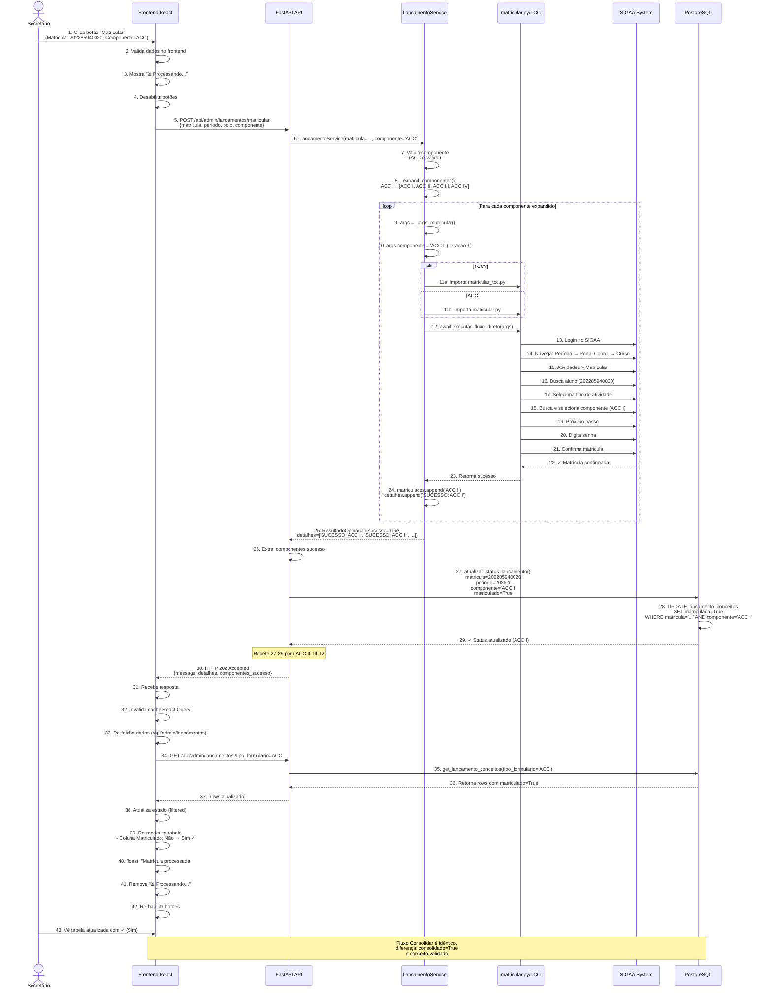
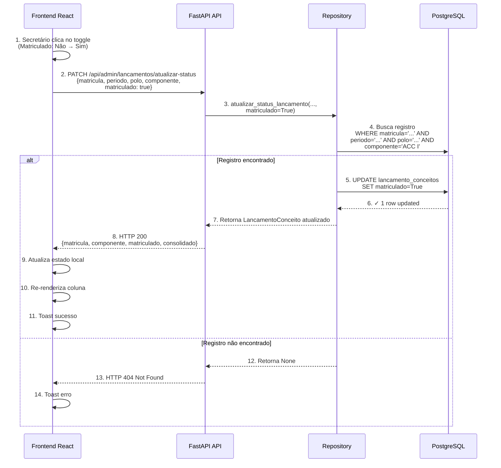
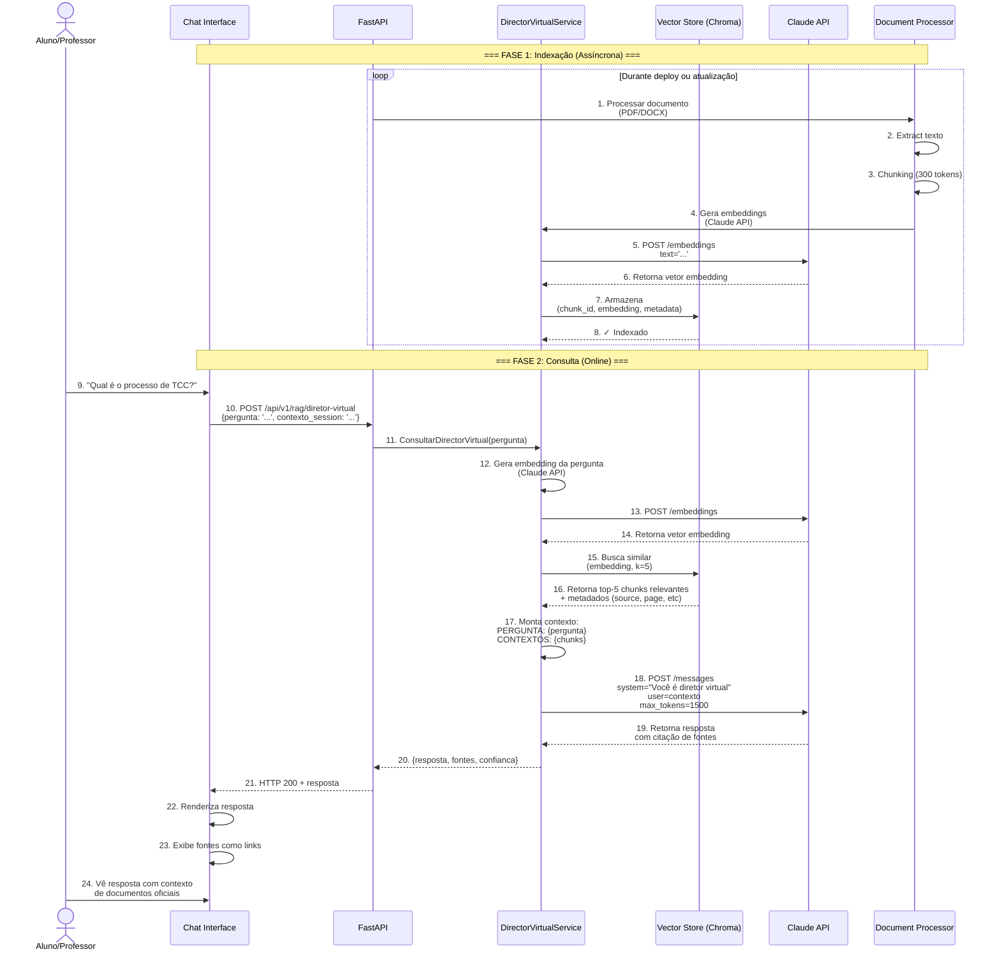
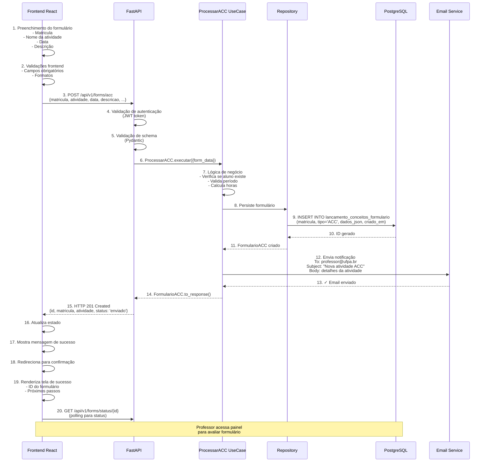
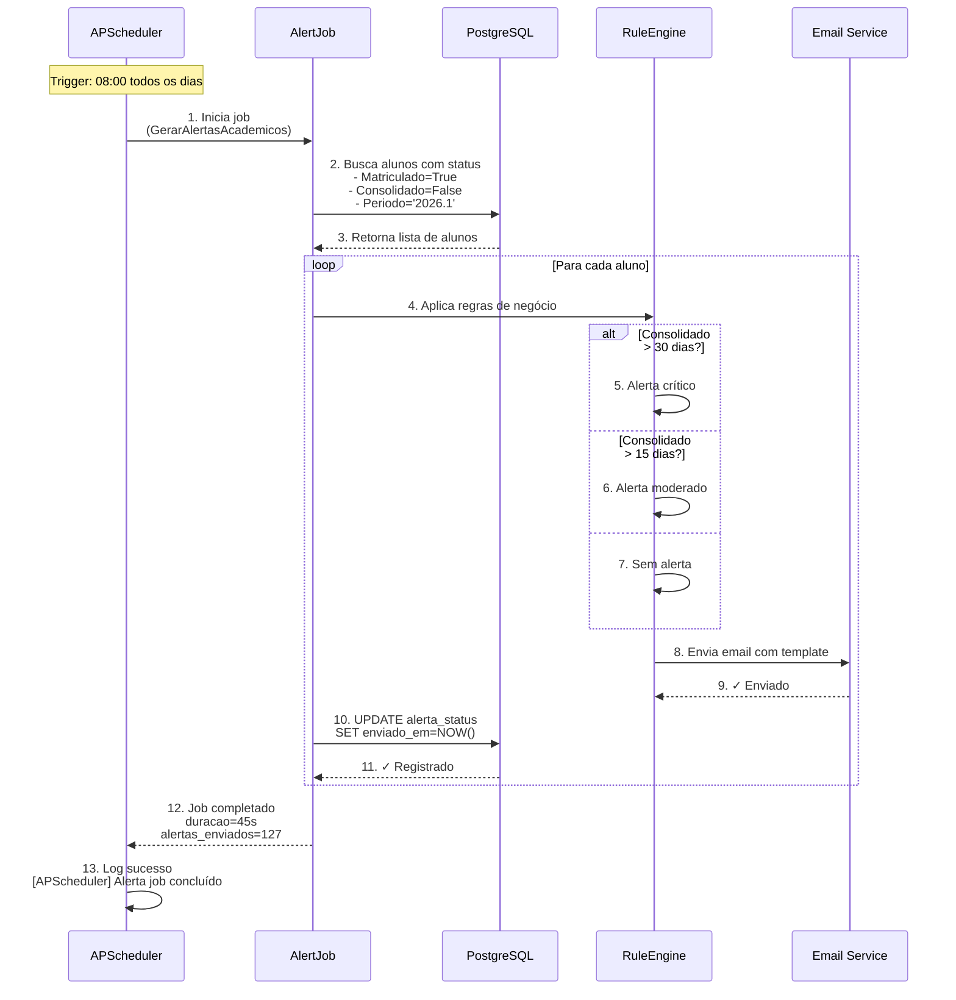
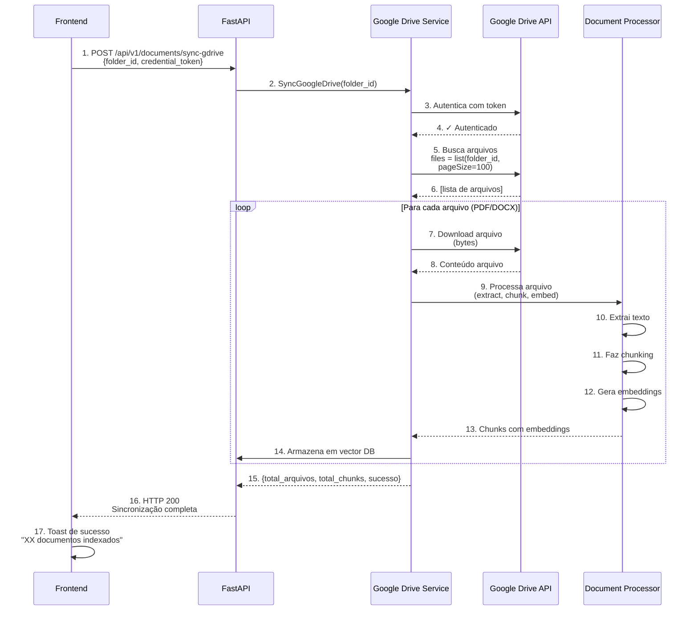
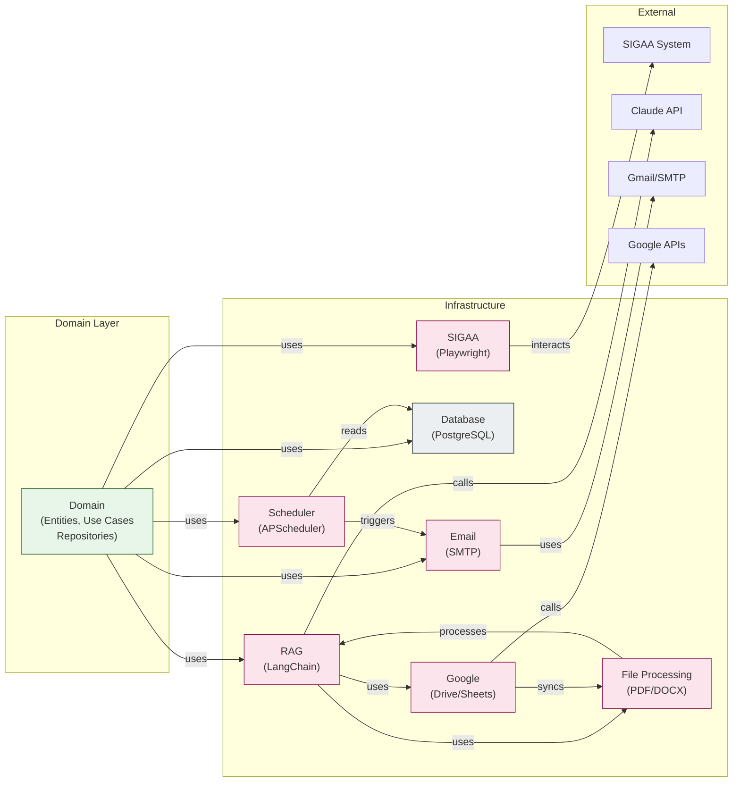

# Fluxos de Integração entre Domínios

## 1. Fluxo Completo: Matrícula e Consolidação (End-to-End)



---

## 2. Fluxo de Atualização Manual de Status



---

## 3. Fluxo RAG: Diretor Virtual



---

## 4. Fluxo de Processamento de Formulário ACC



---

## 5. Fluxo de Scheduler: Geração de Alertas



---

## 6. Fluxo de Integração Google Drive



---

## 7. Matriz de Dependências entre Domínios



---

## 8. Estado da Aplicação (React Query)

```
┌─────────────────────────────────────────────────────────────┐
│             REACT QUERY CACHE STATE                         │
├─────────────────────────────────────────────────────────────┤
│                                                              │
│  queryKey: ['lancamentos', tipo]                            │
│  ├─ status: 'loading' | 'error' | 'success'                │
│  ├─ data: Array<LancamentoConceito>                        │
│  ├─ error: HTTPException | null                            │
│  └─ isStale: boolean (revalidar?)                          │
│                                                              │
│  mutationKey: 'matricular'                                 │
│  ├─ status: 'idle' | 'pending' | 'success' | 'error'      │
│  ├─ isPending: boolean                                     │
│  └─ data: ResultadoOperacao                                │
│                                                              │
│  mutationKey: 'consolidar'                                 │
│  └─ (mesma estrutura)                                      │
│                                                              │
│  mutationKey: 'atualizarStatus'                            │
│  └─ (mesma estrutura)                                      │
│                                                              │
└─────────────────────────────────────────────────────────────┘

FLUXO:
1. useQuery(['lancamentos', tipo]) → fetch dados
2. Exibe tabela com dados
3. Usuário clica botão "Matricular"
4. matricularMutation.mutate(row) → POST request
5. Enquanto isPending:
   - Mostra loader
   - Desabilita botões
   - Exibe "⏳ Processando..."
6. onSuccess:
   - Toast sucesso
   - queryClient.invalidateQueries(['lancamentos'])
   - useQuery refetch automático
   - Tabela atualizada
7. onError:
   - Toast erro
   - Cache mantém dados antigos
```

---

## 9. Fluxo de Deploy

```
┌────────────────────────────────────────────────────────────┐
│  1. Developer commits to main branch                        │
└────────────────┬───────────────────────────────────────────┘
                 ↓
┌────────────────────────────────────────────────────────────┐
│  2. GitHub Actions triggers CI pipeline                    │
│     ├─ Run linters (Python/TypeScript)                     │
│     ├─ Run tests (pytest/Jest)                            │
│     ├─ Build Docker images                                │
│     │  ├─ fasitech-api:latest                             │
│     │  └─ fasitech-frontend:latest                        │
│     └─ Push to registry                                   │
└────────────────┬───────────────────────────────────────────┘
                 ↓
┌────────────────────────────────────────────────────────────┐
│  3. Production Deployment (Manual trigger)                 │
│     ├─ ssh ubuntu@72.60.6.113                             │
│     ├─ cd /home/ubuntu/appStreamLit/                      │
│     ├─ git pull origin main                               │
│     ├─ docker-compose -f docker-compose.production.yml \  │
│     │   pull && up -d --build                             │
│     ├─ Database migrations (auto)                         │
│     └─ Health checks                                      │
└────────────────┬───────────────────────────────────────────┘
                 ↓
┌────────────────────────────────────────────────────────────┐
│  4. Verify Deployment                                      │
│     ├─ curl http://72.60.6.113:8000/health                │
│     ├─ curl http://72.60.6.113/                           │
│     └─ Check logs: docker-compose logs -f api             │
└────────────────────────────────────────────────────────────┘
```

---

## 10. Tabela de Rotas da API Completa

### `/api/v1/forms/` - Formulários
| Método | Rota | Função | Status |
|--------|------|--------|--------|
| POST | `/acc` | Submeter ACC | ✅ |
| POST | `/tcc` | Submeter TCC | ✅ |
| POST | `/estagio` | Submeter Estágio | ✅ |
| POST | `/plano-ensino` | Submeter Plano | ✅ |
| POST | `/projetos` | Submeter Projeto | ✅ |

### `/api/v1/data/` - Dados
| Método | Rota | Função | Status |
|--------|------|--------|--------|
| GET | `/social-data` | Dados sociais | ✅ |
| GET | `/projetos-data` | Lista projetos | ✅ |
| GET | `/tcc-data` | Lista TCC | ✅ |

### `/api/v1/ofertas/` - Ofertas
| Método | Rota | Função | Status |
|--------|------|--------|--------|
| GET | `/disciplinas` | Lista disciplinas | ✅ |

### `/api/v1/rag/` - RAG
| Método | Rota | Função | Status |
|--------|------|--------|--------|
| POST | `/diretor-virtual` | Chat com IA | ✅ |

### `/api/admin/` - Administração
| Método | Rota | Função | Status |
|--------|------|--------|--------|
| GET | `/lancamentos` | Listar lançamentos | ✅ |
| GET | `/lancamentos/componentes-validos` | Lista de componentes | ✅ |
| POST | `/lancamentos/matricular` | Matricular | ✅ |
| POST | `/lancamentos/consolidar` | Consolidar | ✅ |
| PATCH | `/lancamentos/atualizar-status` | Atualizar status | ✅ |
| GET | `/alertas` | Listar alertas | ✅ |

---

## Observações Importantes

### 1. **Padrão de Componente Expandido**
```python
# Input: ACC
# Expandir: ACC → [ACC I, ACC II, ACC III, ACC IV]
# Processar: Cada componente individualmente
# Resultado: Matrícula/Consolidação de todos os 4

COMPONENTES_EXPANDIDOS = {
    "ACC": ["ACC I", "ACC II", "ACC III", "ACC IV"],
    "TCC": ["TCC I", "TCC II"],
}
```

### 2. **Dynamic Imports**
```python
# Seleciona o módulo correto baseado no tipo
if componente_spec.startswith("TCC"):
    from backend.infrastructure.sigaa.matricular_tcc import executar_fluxo_direto
else:
    from backend.infrastructure.sigaa.matricular import executar_fluxo_direto
```

### 3. **Automatic Status Update**
```python
# Após executar a automação, atualiza status na DB
componentes_sucesso = [
    d.replace("SUCESSO: ", "") 
    for d in resultado.detalhes 
    if d.startswith("SUCESSO:")
]

for comp in componentes_sucesso:
    atualizar_status_lancamento(
        matricula=data.matricula,
        periodo=data.periodo,
        polo=data.polo,
        componente=comp,
        matriculado=True  # ou consolidado=True
    )
```

### 4. **Error Handling**
```python
# Coleta erros sem parar o processamento
erros = []
for componente in componentes:
    try:
        # executar
    except Exception as exc:
        erros.append(f"{componente}: {exc}")

# Retorna sucesso parcial mesmo com erros
if matriculados:  # se pelo menos 1 sucesso
    return ResultadoOperacao(
        sucesso=True,
        mensagem=f"...{len(matriculados)} sucesso(s)",
        detalhes=erros + [f"SUCESSO: {c}" for c in matriculados]
    )
```

### 5. **React Query Invalidation**
```typescript
// Invalida cache para forçar refetch
queryClient.invalidateQueries({ queryKey: ['lancamentos'] })

// useQuery automático refetch
const { data, isLoading } = useQuery({
    queryKey: ['lancamentos', tipo],
    queryFn: () => fetch data,
})
```

---

## Conclusão

A arquitetura FasiTech segue **Clean Architecture** com separação clara entre:
- **Domain**: Lógica pura de negócio
- **Infrastructure**: Implementações técnicas
- **Presentation**: APIs e interfaces

Cada **domínio de serviço** (SIGAA, RAG, Database, etc.) é independente e se comunica através de interfaces bem definidas, permitindo:
✅ Testabilidade
✅ Escalabilidade
✅ Manutenibilidade
✅ Integração futura de novos domínios
