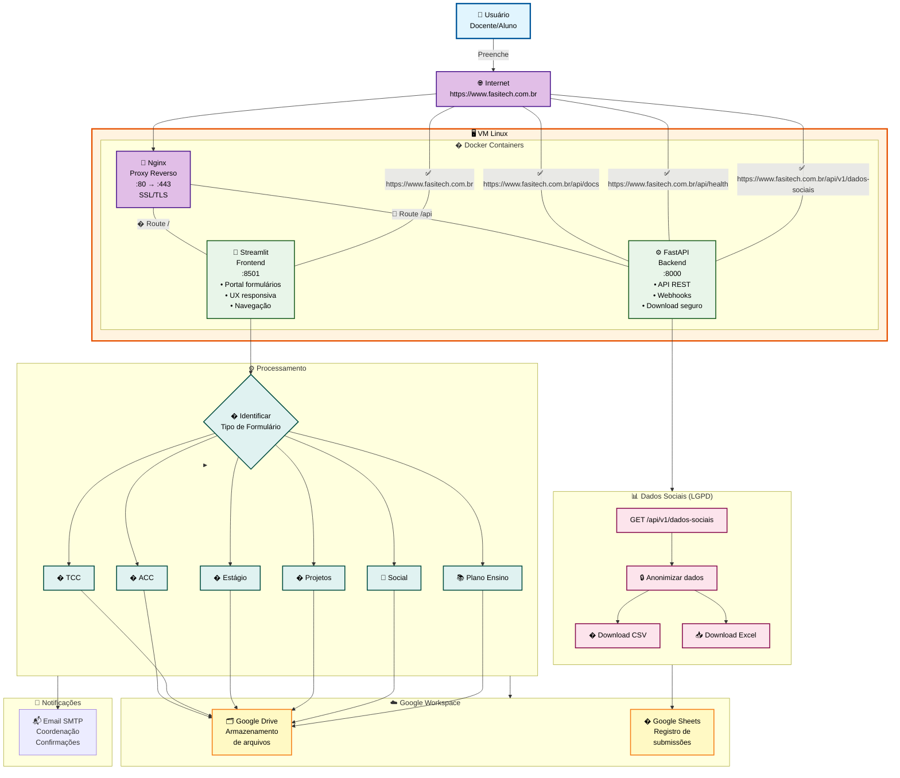

# FasiTech Forms Platform

Solução moderna de formulários web com Streamlit (frontend) e FastAPI (backend), rodando em VM Linux com integrações para Google Drive, Google Sheets e envio de e-mails. Sistema completo com LGPD, download seguro de dados e API REST documentada. 

## 🚦 Camadas do Sistema

- **Frontend:** Streamlit (UX institucional, formulários, navegação)
- **Backend:** FastAPI (API REST, webhooks, download seguro, LGPD)
- **Proxy:** Nginx (HTTPS, roteamento, SSL Let's Encrypt)
- **Armazenamento:** Google Drive, Google Sheets
- **Notificações:** E-mail institucional

## 🛡️ LGPD & Segurança de Dados

- ✅ **Download seguro** de dados sociais via API FastAPI
- ✅ **Anonimização** dos dados para pesquisa
- ✅ **Controle de acesso** por ambiente (dev/prod)
- ✅ **Armazenamento seguro** no Google Drive institucional
- ✅ **Conformidade LGPD**: Dados sensíveis nunca expostos publicamente
- ✅ **Logs e auditoria** de acessos e downloads

## 🎯 Funcionalidades

- ✅ **Portal centralizado** com múltiplos formulários
- ✅ **Formulário ACC** para atividades complementares curriculares
- ✅ **Formulário TCC** para submissão de trabalhos finais
- ✅ **Formulário Requerimento TCC** para registro de defesa
- ✅ **Formulário Estágio** para envio de documentos de estágio
- ✅ **Formulário Plano de Ensino** aceita qualquer tipo de arquivo (PDF, DOC, DOCX, ODT, imagens, etc)
- ✅ **Formulário Projetos** para submissão de projetos de ensino, pesquisa e extensão
- ✅ **Formulário Social** para coleta de dados socioeconômicos dos estudantes
- ✅ **Ofertas de Disciplinas** para consulta de grades curriculares e ofertas por período/turma
- ✅ **FAQ** página de perguntas frequentes e suporte
- ✅ **Upload seguro** de arquivos ao Google Drive
- ✅ **Registro automático** em Google Sheets
- ✅ **Notificações por e-mail** para coordenação
- ✅ **UX moderna** com design responsivo e identidade visual institucional

## 📁 Estrutura principal

```text
├── .streamlit/         # Configurações do Streamlit (tema, secrets)
├── config/             # Configurações por ambiente (dev/prod)
├── src/
│   ├── app/
│   │   ├── main.py     # Página principal com links para formulários
│   │   └── pages/      # Páginas individuais:
│   │       ├── FormACC.py              # Formulário ACC
│   │       ├── FormTCC.py              # Formulário TCC
│   │       ├── FormRequerimentoTCC.py  # Requerimento TCC
│   │       ├── FormEstagio.py          # Formulário Estágio
│   │       ├── FormPlanoEnsino.py      # Formulário Plano de Ensino
│   │       ├── FormProjetos.py         # Formulário Projetos
│   │       ├── FormSocial.py           # Formulário Social
│   │       ├── OfertasDisciplinas.py   # Ofertas de Disciplinas
│   │       └── FAQ.py                  # Página FAQ
│   ├── services/       # Lógica de negócio (Drive, Sheets, Email)
│   ├── models/         # Schemas Pydantic
│   └── utils/          # Utilitários (validadores, criptografia)
├── api/                # Backend FastAPI (opcional)
├── credentials/        # Credenciais Google divididas por ambiente
├── docker/             # Arquivos de containerização
├── scripts/            # Scripts de deploy e automação
└── tests/              # Suite de testes
```

## 📝 Formulários e páginas disponíveis

- **Formulário ACC**: Upload de certificados consolidados (PDF único, máx 10MB)
- **Formulário TCC**: Submissão de documentos obrigatórios do TCC 1/2
- **Formulário Requerimento TCC**: Registro de banca e dados para defesa
- **Formulário Estágio**: Envio de plano e relatório de estágio
- **Formulário Plano de Ensino**: Aceita qualquer tipo de arquivo (PDF, DOC, DOCX, ODT, imagens, etc)
- **Formulário Projetos**: Submissão de projetos de ensino, pesquisa e extensão
- **Formulário Social**: Coleta de dados socioeconômicos dos estudantes
- **Ofertas de Disciplinas**: Consulta de grades curriculares e ofertas por período/turma com visualização colorida por turma
- **FAQ**: Página de perguntas frequentes e suporte aos usuários

## 🚀 Primeiros passos

### 1. Instale as dependências

```bash
python -m venv .venv
source .venv/bin/activate  # No Windows: .venv\Scripts\activate
pip install -r requirements.txt
```

> **Novas dependências:**
> - `openpyxl` (exportação Excel)
> - `pandas` (manipulação de dados)

### 2. Configure os secrets do Streamlit

O arquivo `.streamlit/secrets.toml` já foi criado com valores padrão. Edite-o conforme necessário:

```bash
# Edite o arquivo com suas credenciais reais
nano .streamlit/secrets.toml
```

Estrutura do arquivo:

```toml
[acc]
drive_folder_id = "seu-folder-id-do-google-drive"
sheet_id = "seu-spreadsheet-id"
notification_recipients = ["coordenacao@fasitech.edu.br"]
```

> **Nota:** O arquivo `secrets.toml` está no `.gitignore` e não será commitado ao repositório.

### 3. Adicione credenciais do Google

Coloque o arquivo JSON da conta de serviço do Google em:
- `credentials/dev/service-account-dev.json` (desenvolvimento)
- `credentials/prod/service-account-prod.json` (produção)

### 4. Execute a aplicação

**Opção A: Usando o script de inicialização (Recomendado)**

```bash
# Torna o script executável (apenas na primeira vez)
chmod +x scripts/start.sh

# Execute
./scripts/start.sh
```

**Opção B: Manualmente**

```bash
# Configure o PYTHONPATH e execute
export PYTHONPATH="${PWD}:${PYTHONPATH}"
streamlit run src/app/main.py
```

A aplicação estará disponível em `http://localhost:8501`

### 5. Execute o backend FastAPI

```bash
uvicorn api.main:app --host 0.0.0.0 --port 8000
```

Acesse a documentação da API em:
- `https://www.fasitech.com.br/api/docs` (Swagger UI)
- Endpoints de download: `https://www.fasitech.com.br/api/v1/dados-sociais/download`

## 🧪 Testes

```bash
pytest
```

## 🐳 Docker & Deploy

### Desenvolvimento
```bash
cd docker
docker-compose up
```

### Produção
```bash
# Sincronize o código
rsync -avz --progress --exclude 'venv/' --exclude '.git/' --exclude '__pycache__/' \
    -e "ssh" /home/nees/Documents/VSCodigo/FasiTech/ root@72.60.6.113:/home/ubuntu/appStreamLit

# Rebuild completo
ssh root@72.60.6.113
cd /home/ubuntu/appStreamLit/
sudo docker-compose -f docker-compose.production.yml up -d --build
```

### Atualização rápida
```bash
# Após alterações em código Python
sudo docker-compose -f docker-compose.production.yml restart streamlit api
```

## 🧩 Arquitetura do Sistema



## 📡 Endpoints Disponíveis

### Frontend (Streamlit)
- **`https://www.fasitech.com.br/`** - Portal principal com navegação
- **`https://www.fasitech.com.br/?page=FormACC`** - Formulário ACC
- **`https://www.fasitech.com.br/?page=FormTCC`** - Formulário TCC
- **`https://www.fasitech.com.br/?page=FormEstagio`** - Formulário Estágio
- **`https://www.fasitech.com.br/?page=FormProjetos`** - Formulário Projetos
- **`https://www.fasitech.com.br/?page=FormSocial`** - Formulário Social
- **`https://www.fasitech.com.br/?page=FormPlanoEnsino`** - Formulário Plano de Ensino
- **`https://www.fasitech.com.br/?page=OfertasDisciplinas`** - Ofertas de Disciplinas
- **`https://www.fasitech.com.br/?page=FAQ`** - Página FAQ

### API FastAPI (Dados Sociais - LGPD)
- **`https://www.fasitech.com.br/api/health`** - Health check
- **`https://www.fasitech.com.br/api/v1/dados-sociais`** - GET dados com filtros
- **`https://www.fasitech.com.br/api/v1/dados-sociais/download?format=csv`** - Download CSV anonimizado
- **`https://www.fasitech.com.br/api/v1/dados-sociais/download?format=xlsx`** - Download Excel anonimizado
- **`https://www.fasitech.com.br/api/v1/dados-sociais/estatisticas`** - Estatísticas agregadas
- **`https://www.fasitech.com.br/api/v1/dados-sociais/opcoes`** - Opções de filtros

### Documentação & Admin
- **`https://www.fasitech.com.br/api/docs`** - Swagger UI (documentação interativa)
- **`https://www.fasitech.com.br/api/redoc`** - ReDoc (documentação alternativa)

## 🎨 Personalização

O tema visual está configurado em `.streamlit/config.toml`:
- Cor primária: `#663399` (roxo institucional)
- Gradientes e sombras seguindo design system
- Logo da instituição: `src/resources/fasiOficial.png`

## 📧 Suporte

Em caso de dúvidas, entre em contato com a equipe de TI ou secretaria acadêmica.
