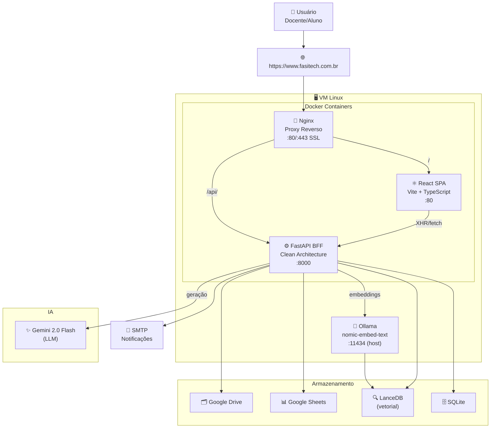

# FasiTech — Portal Acadêmico FASI/UFPA

Portal acadêmico moderno com React SPA (frontend) e FastAPI BFF (backend), rodando em VM Linux com integrações para Google Drive, Google Sheets e envio de e-mails. Sistema completo com LGPD, download seguro de dados e API REST documentada.

## 🚦 Camadas do Sistema

- **Frontend:** React SPA (Vite + TypeScript + Tailwind, React Router, TanStack Query)
- **Backend:** FastAPI — BFF (Clean Architecture, API REST, autenticação, LGPD)
- **Banco de Dados:** SQLite em produção (SQLModel/SQLAlchemy)
- **Proxy:** Nginx (HTTPS, roteamento, SSL Let's Encrypt)
- **Armazenamento:** Google Drive, Google Sheets
- **Notificações:** E-mail institucional (SMTP)
- **IA / RAG:** Gemini 2.0 Flash (LLM) + Ollama nomic-embed-text (embeddings) + LanceDB

## 🛡️ LGPD & Segurança de Dados

- ✅ **Download seguro** de dados sociais via API FastAPI
- ✅ **Anonimização** dos dados para pesquisa
- ✅ **Controle de acesso** por chave de API (admin)
- ✅ **Armazenamento seguro** no Google Drive institucional
- ✅ **Conformidade LGPD**: Dados sensíveis nunca expostos publicamente

## 🎯 Funcionalidades

- ✅ **Portal centralizado** com SPA React e navegação por rotas
- ✅ **Formulário ACC** para atividades complementares curriculares (com análise por IA em background)
- ✅ **Formulário TCC** para submissão de TCC 1 e TCC 2
- ✅ **Formulário Requerimento TCC** para registro de banca e defesa
- ✅ **Formulário Estágio** para envio de documentos de estágio
- ✅ **Formulário Plano de Ensino** aceita PDF, DOC, DOCX, ODT e imagens
- ✅ **Formulário Projetos** para submissão de projetos de ensino, pesquisa e extensão
- ✅ **Formulário Social** para coleta de dados socioeconômicos dos estudantes
- ✅ **Emissão de Documentos** comprovante de conclusão e matrícula ativa (valida histórico SIGAA)
- ✅ **Avaliação de Gestão** pesquisa de satisfação anônima
- ✅ **Consulta de Projetos Docentes** visualização com filtros e métricas
- ✅ **Ofertas de Disciplinas** grades por período/turma
- ✅ **Diretor Virtual (RAG)** chatbot inteligente com busca semântica em documentos institucionais
- ✅ **Dados Sociais** download CSV/Excel anonimizado (LGPD)
- ✅ **Upload seguro** de arquivos ao Google Drive com estrutura hierárquica de pastas
- ✅ **Notificações por e-mail** para coordenação e estudantes

## 📁 Estrutura Principal

```text
├── backend/                    # FastAPI — BFF (Clean Architecture)
│   ├── config/
│   │   └── settings.py         # Configurações via variáveis de ambiente (Pydantic)
│   ├── infrastructure/
│   │   ├── database/           # SQLModel: engine, repositórios, schemas
│   │   ├── documents/          # Emissão de documentos, assinatura digital
│   │   ├── email/              # Serviço de e-mail SMTP
│   │   ├── file_processing/    # Validação e preparação de arquivos
│   │   ├── google/             # Drive e Sheets
│   │   ├── rag/                # Serviço RAG (LanceDB + Gemini + Ollama)
│   │   ├── scheduler/          # APScheduler — alertas automáticos
│   │   └── sigaa/              # Integração SIGAA (lançamentos)
│   ├── presentation/
│   │   ├── api/v1/
│   │   │   ├── forms/          # Endpoints de submissão de formulários
│   │   │   ├── data/           # Endpoints de consulta de dados
│   │   │   ├── rag/            # Endpoint Diretor Virtual
│   │   │   ├── ofertas/        # Endpoint Ofertas de Disciplinas
│   │   │   └── config.py       # Config pública (períodos letivos)
│   │   ├── admin/              # Endpoints admin (alertas, lançamentos)
│   │   ├── dependencies.py     # Autenticação por API key
│   │   └── main.py             # App FastAPI + CORS + routers
│   └── utils/                  # PDFGenerator, datetime, credenciais
├── frontend/                   # React SPA (Vite + TypeScript)
│   ├── src/
│   │   ├── features/           # Páginas por funcionalidade
│   │   │   ├── home/           # HomePage com cards de formulários
│   │   │   ├── form-acc/       # Formulário ACC
│   │   │   ├── form-tcc/       # Formulário TCC
│   │   │   ├── form-estagio/   # Formulário Estágio
│   │   │   ├── form-requerimento-tcc/
│   │   │   ├── form-plano-ensino/
│   │   │   ├── form-projetos/
│   │   │   ├── form-social/
│   │   │   ├── form-emissao-docs/
│   │   │   ├── avaliacao-gestao/
│   │   │   ├── diretor-virtual/ # ChatWidget flutuante
│   │   │   ├── documentos/     # Consulta projetos e ofertas
│   │   │   └── admin/          # Painel admin
│   │   └── shared/             # Componentes, lib, hooks reutilizáveis
│   ├── Dockerfile.frontend
│   └── vite.config.ts
├── resources/                  # Documentos do RAG (.md) e certificado PFX
├── credentials/                # Credenciais Google (base64, fora do git)
├── config/                     # Configs por ambiente
├── docker/
│   └── nginx/nginx.conf        # Proxy reverso com timeouts para IA
├── docker-compose.production.yml
├── docker-compose.productionUFPA.yml
└── .env.production             # Variáveis de produção (na VM, fora do git)
```

## 📝 Formulários e Páginas

| Rota | Funcionalidade |
|------|----------------|
| `/` | Portal principal |
| `/acc` | Formulário ACC |
| `/tcc` | Formulário TCC 1/2 |
| `/estagio` | Formulário Estágio |
| `/requerimento-tcc` | Requerimento de banca |
| `/plano-ensino` | Plano de Ensino |
| `/projetos` | Submissão de Projetos |
| `/social` | Dados Socioeconômicos |
| `/emissao-documentos` | Emissão de Comprovantes |
| `/avaliacao-gestao` | Avaliação de Gestão |
| `/documentos` | Consulta de Projetos Docentes |
| `/ofertas` | Ofertas de Disciplinas |

O **Diretor Virtual** é um widget flutuante presente em todas as páginas.

## 🤖 Diretor Virtual (RAG)

Chatbot inteligente que responde perguntas sobre regulamentos, TCC, ACC, estágio e PPC do curso usando Retrieval-Augmented Generation.

### Arquitetura RAG

```
Pergunta do usuário
        │
  OllamaEmbedder          ← nomic-embed-text:latest (local, 768-dim)
  (vetorização)
        │
  LanceDB Vector Search   ← busca semântica + keyword nos documentos
  (recuperação de contexto)
        │
  Gemini 2.0 Flash        ← LLM via Google API (rápido, ~2–5s)
  (geração da resposta)
        │
  Resposta ao usuário
```

### Documentos Indexados

Todos os arquivos `.md` em `resources/` são automaticamente indexados:

- `FAQ_Docling.md`
- `Regimento_Interno_Docling.md`
- `Resolução ACC FASI 2024_Docling.md`
- `Resolução Estágio 2024.md`
- `TCC_Docling.md`

Para adicionar um novo documento: coloque o arquivo `.md` em `resources/` e reinicie o container da API (a reindexação ocorre automaticamente na inicialização se detectar mudanças).

O Diretor Virtual expõe um endpoint REST documentado em `https://www.fasitech.com.br/docs`.

### Variáveis de ambiente relevantes

```env
OLLAMA_HOST=http://172.18.0.1:11434   # Ollama no host (Docker bridge)
GOOGLE_API_KEY=...                     # Gemini API key
GEMINI_MODEL=gemini-2.0-flash          # Modelo padrão (override opcional)
RAG_DOCUMENTS_DIR=/app/resources       # Caminho dos documentos no container
```

## 🚀 Desenvolvimento Local

### Backend (FastAPI)

```bash
python -m venv .venv && source .venv/bin/activate
pip install -r requirements.txt

# Variáveis de ambiente
cp .env.example .env   # edite com suas credenciais

export PYTHONPATH=$(pwd)
uvicorn backend.presentation.main:app --reload --port 8000
```

Swagger disponível em `http://localhost:8000/docs`.

### Frontend (React)

```bash
cd frontend
npm install
npm run dev   # http://localhost:5173
```

O Vite está configurado com proxy: chamadas para `/api/` são encaminhadas para `http://localhost:8000`.

## 🐳 Docker & Deploy

### Produção

```bash
# 1. Sincronizar código para a VM (sem .env)
rsync -avz --exclude '.env*' --exclude 'node_modules/' --exclude '.git/' \
  /caminho/local/FasiTech/ root@IP_VM:/home/ubuntu/appStreamLit/

# 2. Na VM — rebuild e restart
cd /home/ubuntu/appStreamLit
docker compose -f docker-compose.production.yml build
docker compose -f docker-compose.production.yml up -d
```

### Atualização rápida (sem rebuild)

```bash
# Copiar arquivo alterado direto para o container
docker cp backend/infrastructure/rag/rag_ppc.py fasitech-api-prod:/app/backend/infrastructure/rag/rag_ppc.py

# Reiniciar container
docker restart fasitech-api-prod
```

### Containers em produção

| Container | Imagem | Função |
|-----------|--------|--------|
| `fasitech-api-prod` | `fasitech-bff:latest` | FastAPI BFF (:8000) |
| `fasitech-frontend-prod` | `fasitech-spa:latest` | React SPA servida por nginx (:80) |
| `fasitech-nginx-prod` | `nginx:alpine` | Proxy reverso HTTPS (:80/:443) |


## 📡 Endpoints Disponíveis

### Frontend
- `https://www.fasitech.com.br/` — Portal principal (React SPA)
- `https://www.fasitech.com.br/docs` — Swagger UI (FastAPI)
- `https://www.fasitech.com.br/redoc` — ReDoc

### API REST
- `GET  /health` — Health check
- `GET  /api/v1/config/periodos-letivos` — Períodos disponíveis
- `POST /api/v1/forms/acc` — Submissão ACC
- `POST /api/v1/forms/tcc` — Submissão TCC
- `POST /api/v1/forms/estagio` — Submissão Estágio
- `POST /api/v1/forms/requerimento-tcc` — Requerimento de banca
- `POST /api/v1/forms/plano-ensino` — Plano de Ensino
- `POST /api/v1/forms/projetos` — Projetos
- `POST /api/v1/forms/social` — Dados sociais
- `POST /api/v1/forms/emissao-documentos` — Emissão de comprovantes
- `POST /api/v1/diretor-virtual/chat` — Chatbot RAG
- `GET  /api/v1/dados-sociais/download` — Portal de download (HTML)
- `GET  /api/v1/dados-sociais/download/csv` — CSV anonimizado
- `GET  /api/v1/dados-sociais/download/excel` — Excel anonimizado
- `GET  /api/v1/requerimento-tcc` — Listagem de requerimentos (admin)
- `GET  /api/v1/projetos` — Listagem de projetos (admin)

## 🧩 Arquitetura do Sistema


```mermaid
flowchart TB
    User["👤 Usuário\nDocente/Aluno"]
    Internet["🌐 https://www.fasitech.com.br"]

    subgraph VM["🖥️ VM Linux"]
        subgraph Containers["Docker Containers"]
            Nginx["🔐 Nginx\nProxy Reverso\n:80/:443 SSL"]
            Frontend["⚛️ React SPA\nVite + TypeScript\n:80"]
            API["⚙️ FastAPI BFF\nClean Architecture\n:8000"]
        end
        Ollama["🦙 Ollama\nnomic-embed-text\n:11434 (host)"]
    end

    subgraph Storage["Armazenamento"]
        Drive["🗂️ Google Drive"]
        Sheets["📊 Google Sheets"]
        LanceDB["🔍 LanceDB\n(vetorial)"]
        SQLite["🗄️ SQLite"]
    end

    subgraph AI["IA"]
        Gemini["✨ Gemini 2.0 Flash\n(LLM)"]
    end

    Email["📧 SMTP\nNotificações"]

    User --> Internet --> Nginx
    Nginx -->|"/"| Frontend
    Nginx -->|"/api/"| API
    Frontend -->|"XHR/fetch"| API
    API --> Drive
    API --> Sheets
    API --> SQLite
    API --> Email
    API -->|"embeddings"| Ollama
    API -->|"geração"| Gemini
    Ollama --> LanceDB
    API --> LanceDB
```

## 🔧 Variáveis de Ambiente (.env / .env.production)

```env
# Banco de dados
DATABASE_URL=sqlite:///./fasitech.db

# Google APIs
GOOGLE_CREDENTIALS_BASE64=...
GOOGLE_CREDENTIALS_FASI_BASE64=...
GOOGLE_API_KEY=...              # Gemini

# Email
SMTP_HOST=smtp.gmail.com
SMTP_PORT=587
SMTP_USER=...
SMTP_PASSWORD=...

# Google Drive — pastas por formulário
ACC_FOLDER_ID=...
TCC_FOLDER_ID=...
ESTAGIO_FOLDER_ID=...
PLANO_FOLDER_ID=...
PROJETOS_FOLDER_ID=...

# Google Sheets — planilhas por formulário
ACC_SHEET_ID=...
TCC_SHEET_ID=...
ESTAGIO_SHEET_ID=...
PLANO_SHEET_ID=...
PROJETOS_SHEET_ID=...
SOCIAL_SHEET_ID=...

# Destinatários (CSV de e-mails)
ACC_RECIPIENTS=coord@ufpa.br,...
DESTINATARIOS=coord@ufpa.br

# RAG / IA
OLLAMA_HOST=http://172.18.0.1:11434
RAG_DOCUMENTS_DIR=/app/resources
GEMINI_MODEL=gemini-2.0-flash

# App
ENVIRONMENT=production
API_BASE_URL=https://www.fasitech.com.br
PERIODOS_LETIVOS=2026.1,2026.2,2026.3,2026.4
ADMIN_API_KEYS=chave-secreta-admin
```

## 📧 Suporte

Em caso de dúvidas, entre em contato com a equipe de TI ou secretaria acadêmica.
